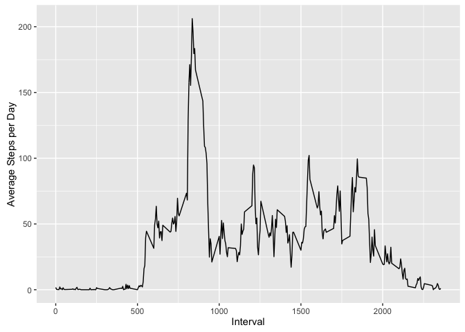

# Reproducible Research: Peer Assessment 1

#### Loading the library function
First, you need to load dplyr `library` function 


```r
library(dplyr)
```

```
## Warning: package 'dplyr' was built under R version 3.2.2
```

```
## 
## Attaching package: 'dplyr'
```

```
## The following objects are masked from 'package:stats':
## 
##     filter, lag
```

```
## The following objects are masked from 'package:base':
## 
##     intersect, setdiff, setequal, union
```
#### Data Import

`"activity.zip"` is the name of the file, which we fork/clone directly from course github site [https://github.com/rdpeng/RepData_PeerAssessment1]. Unzip the file in your local directory. The function `read.csv` is for importing the data into R.


```r
unzip("./activity.zip")
activity <- read.csv("./activity.csv")
```

#### Summaries
Use `str()` to get a quick structure of the data.  


```r
str(activity)
```

```
## 'data.frame':	17568 obs. of  3 variables:
##  $ steps   : int  NA NA NA NA NA NA NA NA NA NA ...
##  $ date    : Factor w/ 61 levels "2012-10-01","2012-10-02",..: 1 1 1 1 1 1 1 1 1 1 ...
##  $ interval: int  0 5 10 15 20 25 30 35 40 45 ...
```
We see that the activity data has 3 variables (steps, date and interval)

##What is mean total number of steps taken per day?

#### Calculating total steps per day
We use `aggregate` function to calculate the total steps per day. It computes the summary statistics sum , by grouping the data BY date and compute the summary statistics. The output is stored in stepsPerDay


```r
stepsPerDay <- aggregate(steps ~ date,data=activity,sum)
```

#### plotting the histogram 
To plot the histogram of total # of steps, we use `ggplot2` library function. To get user defined breaks, load the `scales` library.


```r
library(ggplot2)
```

```
## Warning: package 'ggplot2' was built under R version 3.2.3
```


```r
g1 <- ggplot(stepsPerDay,aes(steps)) + geom_histogram(bins = 10, 
                                                     col="brown",
                                                     fill="sky blue",
                                                     alpha= .5) +
        scale_x_continuous(breaks=seq(0,24000,by=2500)) +
        labs(title="Histogram of total number of steps taken each day") +
        labs(x = "Total Steps per Day", y = "Count") 
        
print(g1) 
```


#### calculating the mean and median of the total number of steps taken per day


```r
avg_stepsPerDay <- mean(stepsPerDay$steps)
median_stepsPerDay <- median(stepsPerDay$steps)
```
Printing the mean and median steps


```r
print(avg_stepsPerDay)
```

```
## [1] 10766.19
```

```r
print(median_stepsPerDay)
```

```
## [1] 10765
```

##What is the average daily activity pattern?

#### Plotting a time series plot of the 5-minute interval (x-axis) and the average number of steps taken, averaged across all days

Identifier of the 5-minute is stored in the variable `interval`.We group the data by `interval` and summarizing the average number of steps.


```r
stepsPerhour <- activity %>%
        group_by(interval) %>%
        summarise(mean_rbi=mean(steps,na.rm=TRUE))
```

and Plotting

```r
g2 <- ggplot(stepsPerhour,aes(interval,mean_rbi)) +
        geom_line() +
        labs(x = "Interval", y = "Average Steps per Day") 
print(g2)
```



#### To know which 5-minute interval, on average across all the days in the dataset, contains the maximum number of steps

```r
maxSteps<- stepsPerhour$interval[which.max(stepsPerhour$mean_rbi)]
print(maxSteps)
```

```
## [1] 835
```

##Imputing missing values

To calculate how many missing NA's we use the logical function `is.na` and get the sum

```r
missing_num <- sum(is.na(activity))
print(missing_num)
```

```
## [1] 2304
```
#### Filling the missing obs with mean from steps Per Hour calculation
To fill in all of the missing values in the dataset, the strategy is here to fill with the  mean for that 5-minute interval 


```r
# creating a new data 
FillIndata <- activity
for (i in 1:nrow(FillIndata)) {
        # checking for missing values
        if (is.na(FillIndata$steps[i])) {
               indx <- which(FillIndata$interval[i] == stepsPerhour$interval)
                # Assign the value to replace the NA's
                FillIndata$steps[i] <- stepsPerhour[indx,]$mean_rbi
        }
}
```

Getting the total number of steps from the new filled data set and plotting the histogram


```r
stepsPerDay_FillIndata <- aggregate(steps ~ date,data=FillIndata,sum)

# # plotting the histogram
g3 <- ggplot(stepsPerDay_FillIndata,aes(steps)) + geom_histogram(bins = 10, 
                                                      col="brown",
                                                      fill="sky blue",
                                                      alpha= .5) +
        scale_x_continuous(breaks=seq(0,24000,by=2500)) +
        labs(title="Histogram of total number of steps taken each day-(Imputing NA's)") +
        labs(x = "Total Steps per Day", y = "Count") 

print(g3)     
```


#### calculating the mean and median of the total number of steps taken per day 
calculate the mean and median from the new filled data.

```r
avg_stepsPerDay_FillIndata <- mean(stepsPerDay_FillIndata$steps)
median_stepsPerDay_FillIndata <- median(stepsPerDay_FillIndata$steps)
```


#### Comparing before and after filling the NA's


```r
cat(sprintf("\"%f\" \"%f\"\n", avg_stepsPerDay, avg_stepsPerDay_FillIndata))
```

```
## "10766.188679" "10766.188679"
```

```r
cat(sprintf("\"%f\" \"%f\"\n", median_stepsPerDay, median_stepsPerDay_FillIndata))
```

```
## "10765.000000" "10766.188679"
```

Mean did not change after filling up the NA's. Histogram looks similar before and after. So NA's didn't effect the data much.


##Are there differences in activity patterns between weekdays and weekends?

Creating a new factor variable in the dataset indicating whether a given date is a weekday or weekend day.


```r
FillIndata$wkday <- as.factor(weekdays(as.Date(FillIndata$date)))
FillIndata$wktype <- "weekDay"
FillIndata$wktype[FillIndata$wkday %in% c("Saturday","Sunday")]<- "weekEnd"
```

Summarizing the average by grouping by week type (i.e week day or week end)

```r
wkday_avg <- FillIndata %>%
                group_by(interval,wktype) %>%
                summarise(mean_rbi=mean(steps)) 

wkday_avg$wktype <- as.factor(wkday_avg$wktype)
```

plotting the panels  containing a time series plot of the 5-minute interval (x-axis) and the average number of steps taken, averaged across all weekday days or weekend days (y-axis)


```r
library(lattice)

g4 <- xyplot(mean_rbi~interval|wktype, wkday_avg,type='l',layout=c(1,2),xlab = "interval",
       ylab="Total Number of Steps")
print(g4)
```


During Week Days, people are active during early hours and then there is slow rate. During Week Ends, there is progress motion throught out the day
